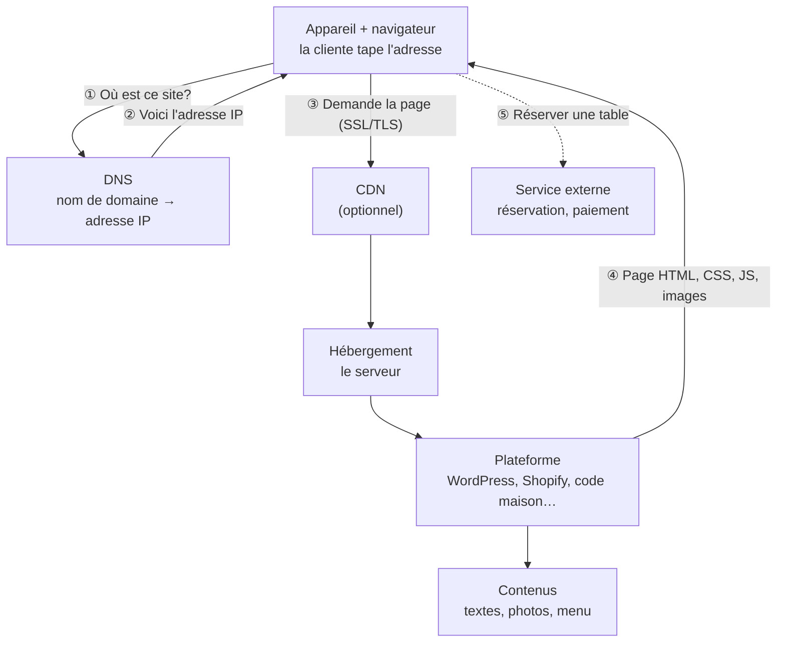

# Séance 1 — Ce qu'il faut pour mettre un site en ligne

## Objectifs
- Nommer les ressources techniques nécessaires pour mettre un site en ligne.
- Expliquer le rôle de chacune dans le trajet d'une page Web.
- Distinguer ce qu'on paie une seule fois de ce qu'on paie chaque année.
- Reconnaître les trois sortes de contraintes d'un projet : techniques, organisationnelles et de ressources.

## Déroulement de la séance

| Heure | Activité |
|:--|:--|
| 18 h 30 | Accroche — Combien coûte ce site ? |
| 18 h 45 | Présentation du cours |
| 19 h 00 | Activité — Le trajet d'une page Web, puis retour en groupe |
| 19 h 40 | Les ressources techniques et les trois sortes de contraintes |
| 20 h 00 | Pause |
| 20 h 15 | [Lab 01 — Enquête technique](./../../labs/lab01-enquete-technique) (en duo) |
| 21 h 45 | Mise en commun |

---

## Accroche — Combien coûte ce site ?

Trois restaurants ont un site Web. Pour chacun, estimez :
1. **combien** il a coûté à construire ;
2. **combien de temps** il a fallu ;
3. **combien de personnes** y ont travaillé ;
4. **combien** il coûte **chaque année** pour rester en ligne.

| | Restaurant | Ce que fait le site |
|:-:|:--|:--|
| **A** | Un café de quartier | Une page : photos, heures d'ouverture, adresse, lien vers Facebook |
| **B** | Un bistro gastronomique | Plusieurs pages, menu mis à jour chaque saison, réservation en ligne, bilingue |
| **C** | Une chaîne de 60 restaurants | Commande en ligne, programme de fidélité, compte client, application mobile, localisateur de succursales |

<strong>Ordres de grandeur</strong> (à ouvrir après la discussion)

| | Construction | Délai | Équipe | Chaque année |
|:-:|:--|:--|:--|:--|
| **A** | 0 $ à quelques centaines de dollars (fait soi-même avec Wix, Squarespace…) | Une fin de semaine | 1 personne, souvent la propriétaire | Quelques centaines de dollars (abonnement + nom de domaine) |
| **B** | Quelques milliers à ~15 000 $ (pigiste ou petite agence, souvent WordPress) | Quelques semaines | 1 à 3 personnes | Quelques centaines à quelques milliers de dollars (hébergement, extensions, entretien, réservation) |
| **C** | Des dizaines, voire des centaines de milliers de dollars (agence, développement sur mesure) | Plusieurs mois | Une équipe complète | Des dizaines de milliers de dollars (serveurs, licences, équipe, sécurité) |

Ces chiffres sont des **ordres de grandeur** pour lancer la discussion, pas des prix à citer dans un rapport. Apprendre à trouver de vrais prix fait partie de la séance 3.

**Ce qu'il faut retenir :** « faire un site Web » peut vouloir dire des choses très différentes. Avant de juger si un projet est faisable, il faut savoir **de quoi il est fait**.

---

## Présentation du cours

- [Plan de cours](./../../plan-cours/plan-de-cours) et [calendrier](./../../plan-cours/calendrier)
- Deux parties :
  - **Partie 1 — HK29** (séances 1 à 8) : évaluer la faisabilité technique d'un projet.
  - **Partie 2 — HK33** (séances 8 à 19) : collaborer à la conception d'un projet Web.
- Un **mandat de client** servira de fil conducteur pour toute la session. Il sera présenté à la **séance 2**, en même temps que la formation des équipes (2 ou 3 personnes, les mêmes toute la session).

| Évaluation | Pondération | Travail |
|:--|:-:|:--|
| Rapport de faisabilité technique — Évaluation technique | 20 % | En équipe |
| Rapport de faisabilité technique — Proposition technique | 20 % | En équipe |
| Collaborer à un projet Web agile — Évaluation du projet | 20 % | En équipe |
| Collaborer à un projet Web agile — Proposition d'un échéancier (synthèse) | 40 % | Individuel |

<strong>À savoir dès maintenant</strong> 
<ul class="list-disc pl-5">
  <li>Chaque jour de retard entraîne une pénalité de 10 %. Après 7 jours, la note est zéro.</li>
  <li>Les deux premiers rapports sont aussi évalués sur la qualité du français.</li>
  <li>L'utilisation de l'intelligence artificielle générative est encadrée : lisez la section du plan de cours à ce sujet.</li>
</ul>

---

## Le trajet d'une page Web

Activité : [Le trajet d'une page Web (casse-tête)](./activite-casse-tete)

Quand une cliente tape `bistro-exemple.ca` dans son téléphone, voici ce qui se passe :

1. Le **navigateur** demande au **DNS** : « à quelle adresse se trouve `bistro-exemple.ca` ? ».
2. Le DNS répond avec l'**adresse IP** du serveur. Le nom de domaine a été loué chez un **registraire**.
3. Le navigateur contacte le serveur par une **connexion sécurisée** (le cadenas, grâce au **certificat SSL/TLS**). Souvent, un **CDN** reçoit la demande en premier pour répondre plus vite.
4. L'**hébergement** fait fonctionner la **plateforme**, qui assemble les **contenus** et renvoie la page.
5. Certaines fonctions ne sont pas dans le site lui-même : la réservation ou le paiement passent souvent par un **service externe**.

Le **courriel professionnel** ne fait pas partie du trajet de la page, mais il utilise le même nom de domaine. Changer de fournisseur sans précaution peut le briser.

### Démonstration — ce site-ci

Le site du cours que vous consultez est **hébergé gratuitement** sur GitHub Pages. En direct, on regarde :
- ce qui est gratuit : l'hébergement, le certificat, le déploiement automatique ;
- ce qui ne l'est pas : un nom de domaine personnalisé (p. ex. `mon-cours.ca`) coûterait quelques dizaines de dollars par année ;
- les limites : ce type d'hébergement ne permet ni base de données, ni paiement, ni compte utilisateur.

Même un site « gratuit » a des **limites techniques** qui décident de ce qu'il peut faire.

---

## Les ressources techniques d'un projet Web

| Ressource | À quoi elle sert | Qui la fournit | Comment on la paie |
|:--|:--|:--|:--|
| **Nom de domaine** | L'adresse du site (`.ca`, `.com`, `.quebec`…) | Un registraire | Chaque année |
| **DNS** | Relier le nom de domaine au serveur et au courriel | Le registraire, l'hébergeur ou un service comme Cloudflare | Souvent inclus |
| **Hébergement** | Le serveur qui garde le site et le rend accessible | Un hébergeur ou la plateforme elle-même | Chaque mois ou chaque année |
| **Certificat SSL/TLS** | Chiffrer la connexion (le cadenas) | L'hébergeur, souvent gratuitement | Souvent inclus |
| **Plateforme** | Construire et gérer le site | Logiciel libre (WordPress), service par abonnement (Wix, Shopify) ou développement sur mesure | Abonnement, licences ou développement |
| **CDN** | Accélérer et protéger le site | Cloudflare, Fastly… | Gratuit à payant |
| **Contenus** | Ce que le visiteur vient chercher | Le client, un photographe, un rédacteur… | Temps du client ou honoraires |
| **Services externes** | Réservation, paiement, livraison, infolettre | Libro, OpenTable, Stripe… | Abonnement ou frais par transaction |
| **Navigateurs et appareils** | Afficher le site | Le visiteur | — mais il faut **tester** sur plusieurs |

<strong>Pièges fréquents</strong> 
<ul class="list-disc pl-5">
  <li><strong>Confondre nom de domaine et hébergement.</strong> On peut louer le nom chez une entreprise et héberger le site chez une autre.</li>
  <li><strong>Croire que « gratuit » veut dire sans coût.</strong> Les forfaits gratuits imposent souvent de la publicité, une adresse du genre <code>monresto.wixsite.com</code> ou des limites.</li>
  <li><strong>Oublier les coûts récurrents.</strong> Le site se paie chaque année, pas seulement au lancement.</li>
  <li><strong>Prendre le CDN pour l'hébergeur.</strong> Si un outil indique « Cloudflare », le site est souvent hébergé ailleurs, derrière Cloudflare.</li>
  <li><strong>Oublier le mobile.</strong> Pour un restaurant, une grande partie des visites se font sur téléphone.</li>
</ul>

---

## Les trois sortes de contraintes

Une **contrainte**, c'est tout ce qui limite les choix possibles dans un projet.

| Sorte | La question à se poser | Exemples |
|:--|:--|:--|
| **Techniques** | Qu'est-ce que la technologie permet ou impose ? | La plateforme ne permet pas la commande en ligne ; le site doit fonctionner sur les vieux téléphones ; le système de réservation actuel ne s'intègre pas au site. |
| **Organisationnelles** | Comment le client fonctionne-t-il ? | Personne n'a le temps de mettre le menu à jour ; trois associés doivent approuver chaque décision ; le site doit respecter les lois sur la vie privée et la langue française. |
| **De ressources** | De quoi dispose-t-on ? | Budget de 3 000 $ ; lancement dans 6 semaines ; aucune personne à l'interne qui connaît WordPress. |

### Retour sur l'accroche

| Restaurant | Une contrainte probable |
|:--|:--|
| **A** — Café de quartier | **Ressources** : aucun budget, la propriétaire fait tout elle-même. C'est pour ça qu'elle a choisi Wix. |
| **B** — Bistro | **Organisationnelle** : le menu change chaque saison et c'est le chef qui doit pouvoir le modifier, sans l'aide d'un programmeur. |
| **C** — Chaîne | **Technique** : la commande en ligne doit communiquer avec les caisses de 60 restaurants. |

Une même situation touche souvent **plusieurs sortes** de contraintes à la fois. À la séance 2, on classera toutes les contraintes du mandat du client.

---

## À faire maintenant

➡️ [Lab 01 — Enquête technique : comparer deux sites](./../../labs/lab01-enquete-technique)
